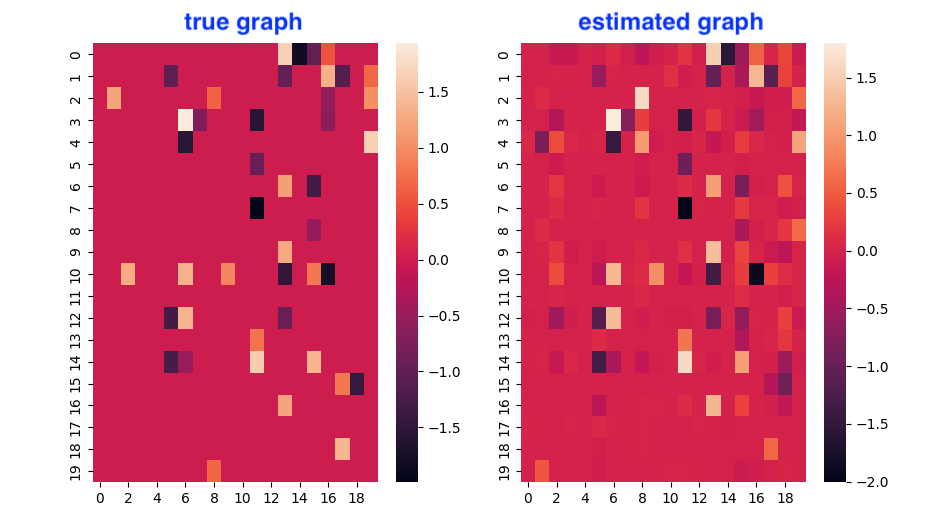

# Causal discovery

Causal discovery is the process of inferring causal relationships between variables from observational data. This repository aims to provide a collection of causal discovery algorithms implemented in Python.

## Development setup

This repository uses [Poetry](https://python-poetry.org/) as a dependency manager. To install the dependencies, run:

```zsh
$ poetry install
```

## Algorithms

| Algorithm | Reference |
|-----------|-----------|
| **NOTEARS** | [DAGs with NO TEARS: Continuous Optimization for Structure Learning, 2019](https://arxiv.org/abs/1803.01422) |

## Results

This is the example of the results of the algorithm.


