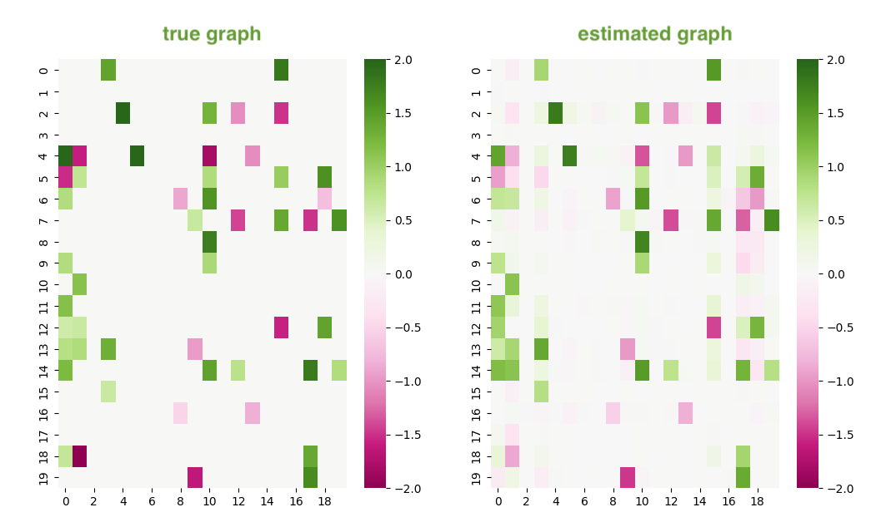

# Causal discovery

Causal discovery is the process of inferring causal relationships between variables from observational data. This repository aims to provide a collection of causal discovery algorithms implemented in Python.

## Development setup

This repository uses [Poetry](https://python-poetry.org/) as a dependency manager. To install the dependencies, run:

```zsh
$ poetry install
```

## Usage

You can install the package from PyPI:

```zsh
$ pip install causal-discovery
```

example usage:

```python
from causal_discovery.algos.notears import NoTears

# load dataset
dataset = ...  

# initialize model
model = NoTears(
    rho=1, 
    alpha=0.1, 
    l1_reg=0, 
    lr=1e-2
)

# learn the graph
_ = model.learn(dataset)

# adjacency matrix
print(model.get_result())
```

## Algorithms

| Algorithm | Reference |
|-----------|-----------|
| **NOTEARS** | [DAGs with NO TEARS: Continuous Optimization for Structure Learning, 2019](https://arxiv.org/abs/1803.01422) |

## Results

This is the example of the results of the algorithm.



How to read this figure: for any value in coordinate (x, y) means the causal effect from y -> x.
